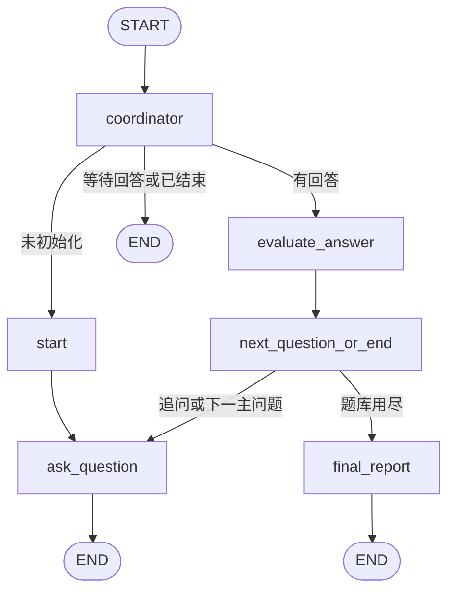

# 基于 LangGraph 的多 Agent 技术面试系统

使用 **LangGraph** `StateGraph` 编排 **Coordinator**、**Interviewer（ReAct）**、**Evaluator（CoT）** 三个逻辑角色，完成出题、追问、切题与最终评估闭环。状态通过 **MemorySaver** 检查点按 `thread_id`（即 `session_id`）持久化，可在**同一进程**内中断后继续。

## Agent 职责

| 名称 | 职责 |
|------|------|
| **Coordinator** | 入口路由：未初始化 → `start`；收到候选人回答 → `evaluate_answer`；已结束 → 结束。与 `next_question_or_end` 共同完成阶段调度（无独立对话）。 |
| **Interviewer** | 在 `ask_question` 节点中执行：每轮必须先 `Thought:` 再 `Action:`，并输出 `Utterance:` 作为对候选人自然语言问题。 |
| **Evaluator** | 在 `evaluate_answer` / `final_report` 中执行：三阶段 CoT 文字 + JSON 权重；不直接与候选人交互。 |

## 状态流转（LangGraph）



说明：每一轮用户作答后，在一次 `invoke` 内会走 `evaluate_answer → next_question_or_end →（ask_question | final_report）→ END`，从而在追问/切题之间用**条件跳转**完成编排。

## 状态 Schema

- **TypedDict**：`src/interview/state.py` 中的 `InterviewState`（含 `transcript` 归约拼接）。
- **Pydantic 镜像**：`InterviewStateModel` / `EvaluatorCoTRecordModel`，便于后续接 HTTP 校验。

核心字段：`session_id`、`main_questions`、`main_question_index`、`last_question_asked`、`candidate_answer`、`latest_evaluator_cot`（含阶段 1–3 与 `weight_follow_up` / `weight_next_question`）、`latest_interviewer_react`、`should_follow_up`、`question_complete`、`final_report`。

## 运行步骤

1. **Python**：建议 3.10+（3.9 需已安装 `typing_extensions`）。
2. 安装依赖：

```bash
cd ai面试官
pip install -r requirements.txt
```

3. 配置环境变量（可复制 `.env.example` 为 `.env`）：

**OpenAI 官方**

- `OPENAI_API_KEY`（必填）
- `INTERVIEW_MODEL`（可选，默认 `gpt-4o-mini`）

**智谱 GLM（OpenAI 兼容）**

- `OPENAI_BASE_URL=https://open.bigmodel.cn/api/paas/v4/`
- `OPENAI_API_KEY` 填智谱开放平台的 API Key；或只设 `ZHIPU_API_KEY`（不设 `OPENAI_API_KEY` 时会自动使用智谱默认地址）
- `INTERVIEW_MODEL` 例如 `glm-4-flash`、`glm-4-plus`（以控制台为准）

其他兼容网关：通过 `OPENAI_BASE_URL` + `OPENAI_API_KEY` 即可。

4. **命令行演示**（完整一轮面试）：

```bash
set PYTHONPATH=src
python demo/cli.py --role "后端 / 数据库" --max-main 2
```

同一终端进程内再次指定 `--session <上次的 id>` 且检查点仍存在时，可从未完成处继续（见运行日志中的 `session_id`）。

5. **Web 演示（Streamlit）**：

```bash
set PYTHONPATH=src
streamlit run demo/streamlit_app.py
```

## 扩展 Evaluator 模型

在 `src/interview/llm.py` 的 `get_interview_llm` 中统一读取 `INTERVIEW_MODEL` 与 `OPENAI_BASE_URL`，也可在 `build_interview_app(llm_factory=...)` 注入自定义 `BaseChatModel`，无需改图结构。

## 提示模板位置

- Interviewer（ReAct）：`src/interview/prompts.py` → `INTERVIEWER_SYSTEM` / `build_interviewer_user_prompt`
- Evaluator（CoT + JSON 权重）：`EVALUATOR_SYSTEM` / `build_evaluator_user_prompt`
- 最终报告：`FINAL_REPORT_SYSTEM` / `build_final_report_user_prompt`

## 目录结构

| 路径 | 说明 |
|------|------|
| `src/interview/state.py` | 状态 TypedDict / Pydantic |
| `src/interview/prompts.py` | 三套提示模板 |
| `src/interview/parsing.py` | ReAct / CoT 解析 |
| `src/interview/graph.py` | `StateGraph`、节点、`MemorySaver` |
| `src/interview/questions.py` | 演示用主问题题库 |
| `demo/cli.py` | 命令行 Demo |
| `demo/streamlit_app.py` | Web Demo |
| `scripts/smoke_mock.py` | 无 API Key 的构图冒烟（Mock LLM） |

## 验收对照（需求摘要）

- LangGraph 有向图 + `start` / `ask_question` / `evaluate_answer` / `next_question_or_end` + `coordinator` 入口路由 + `final_report`。
- Interviewer：强制 `Thought:` / `Action:` / `Utterance:` 段落。
- Evaluator：阶段 1–3 可审计 + JSON 权重建议下一节点倾向。
- Checkpointer：`build_interview_app()` 默认内存检查点，按 `session_id` 绑定 `thread_id`。
